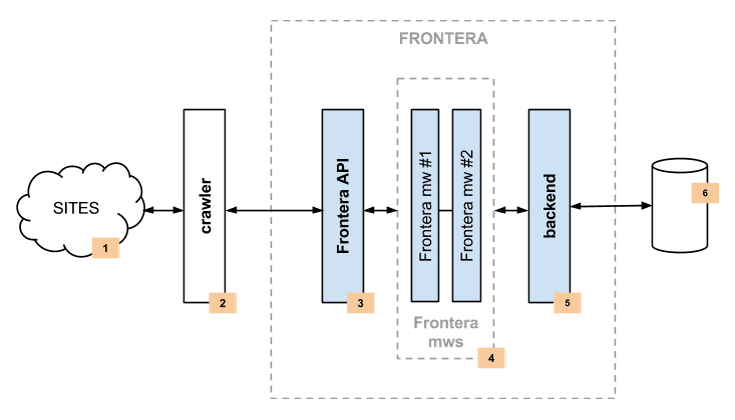
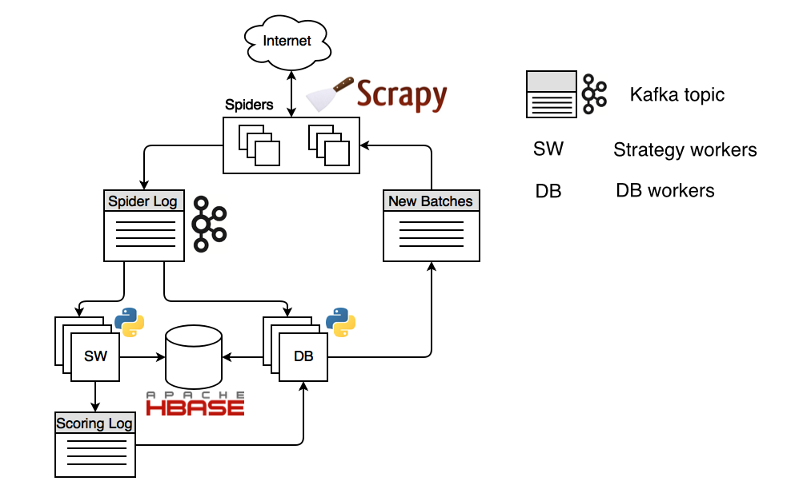

=====================
Architecture overview
=====================

This document describes the Frontera Manager pipeline, distributed components and how they interact.

Single process
==============

The following diagram shows an architecture of the Frontera pipeline with its components (referenced by numbers)
and an outline of the data flow that takes place inside the system. A brief description of the components is included
below with links for more detailed information about them. The data flow is also described below.

Components
----------

Fetcher
^^^^^^^

The Fetcher (2) is responsible for fetching web pages from the sites (1) and feeding them to the frontier which manages
what pages should be crawled next.

Fetcher can be implemented using `Scrapy`_ or any other crawling framework/system as the framework offers a generic
frontier functionality.

In distributed run mode Fetcher is replaced with message bus producer from Frontera Manager side and consumer from
Fetcher side.

Frontera API / Manager
^^^^^^^^^^^^^^^^^^^^^^

The main entry point to Frontera API (3) is the :class:`FrontierManager <frontera.core.manager.FrontierManager>` object.
Frontier users, in our case the Fetcher (2), will communicate with the frontier through it.

For more information see :doc:`frontier-api`.

Middlewares
^^^^^^^^^^^

Frontier middlewares (4) are specific hooks that sit between the Manager (3) and the Backend (5). These middlewares
process :class:`Request <frontera.core.models.Request>` and :class:`Response <frontera.core.models.Response>`
objects when they pass to and from the Frontier and the Backend. They provide a convenient mechanism for extending
functionality by plugging custom code. Canonical URL solver is a specific case of middleware responsible for
substituting non-canonical document URLs wiht canonical ones.

For more information see :doc:`frontier-middlewares` and :doc:`frontier-canonicalsolvers`

Backend
^^^^^^^

The frontier Backend (5) is where the crawling logic/policies lies. It's responsible for receiving all the crawl info
and selecting the next pages to be crawled. Backend is meant to be operating on higher level, and
:class:`Queue <frontera.core.components.Queue>`, :class:`Metadata <frontera.core.components.Metadata>` and
:class:`States <frontera.core.components.States>` objects are responsible for low-level storage communication code.

May require, depending on the logic implemented, a persistent storage (6) to manage
:class:`Request <frontera.core.models.Request>` and :class:`Response <frontera.core.models.Response>`
objects info.

For more information see :doc:`frontier-backends`.

.. _frontier-data-flow:

Data Flow
---------

The data flow in Frontera is controlled by the Frontier Manager, all data passes through the
manager-middlewares-backend scheme and goes like this:

1. The frontier is initialized with a list of seed requests (seed URLs) as entry point for the crawl.
2. The fetcher asks for a list of requests to crawl.
3. Each url is fetched and the frontier is notified back of the crawl result as well of the extracted data the page
   contains. If anything went wrong during the crawl, the frontier is also informed of it.

Once all urls have been crawled, steps 2-3 are repeated until crawl of frontier end condition is reached.
Each loop (steps 2-3) repetition is called a :ref:`frontier iteration <frontier-iterations>`.

Distributed
===========

The same Frontera Manager pipeline is used in all Frontera processes when running in distributed mode.

Overall system forms a closed circle and all the components are working as daemons in infinite cycles.
There is a :term:`message bus` responsible for transmitting messages between components, persistent storage and
fetchers (when combined with extraction these processes called spiders). There is a transport and storage layer
abstractions, so one can plug it's own transport. Distributed backend run mode has instances of three types:

- **Spiders** or fetchers, implemented using Scrapy (sharded).
    Responsible for resolving DNS queries, getting content from the Internet and doing link (or other data) extraction
    from content.
- **Strategy workers** (sharded).
    Run the crawling strategy code: scoring the links, deciding if link needs to be scheduled and when to stop crawling.
- **DB workers** (sharded).
    Store all the metadata, including scores and content, and generating new batches for downloading by spiders.

Where *sharded* means component consumes messages of assigned partition only, e.g. processes certain share of the
stream, and *replicated* is when components consume stream regardless of partitioning.

Such design allows to operate online. Crawling strategy can be changed without having to stop the crawl. Also
:doc:`crawling strategy <own_crawling_strategy>` can be implemented as a separate module; containing logic
for checking the crawling stopping condition, URL ordering, and scoring model.

Frontera is polite to web hosts by design and each host is downloaded by no more than one spider process.
This is achieved by stream partitioning.

Data flow
---------

Let’s start with spiders. The seed URLs defined by the user inside spiders are propagated to strategy workers and DB
workers by means of :term:`spider log` stream. Strategy workers decide which pages to crawl using state
cache, assigns a score to each page and sends the results to the :term:`scoring log` stream.

DB Worker stores all kinds of metadata, including content and scores. Also DB worker checks for the spider’s consumers
offsets and generates new batches if needed and sends them to :term:`spider feed` stream. Spiders consume these batches,
downloading each page and extracting links from them. The links are then sent to the ‘Spider Log’ stream where they are
stored and scored. That way the flow repeats indefinitely.

.. _`Kafka`: http://kafka.apache.org/
.. _`ZeroMQ`: http://zeromq.org/
.. _`HBase`: http://hbase.apache.org/
.. _`Scrapy`: http://scrapy.org/
.. _`Frontera`: http://github.com/scrapinghub/frontera

