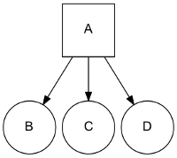
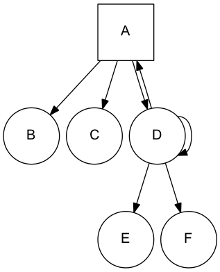
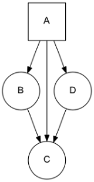
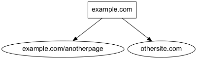

=============
Graph Manager
=============

The Graph Manager is a tool to represent web sitemaps as a graph.

It can easily be used to test frontiers. We can "fake" crawler request/responses by querying pages to the graph manager,
and also know the links extracted for each one without using a crawler at all. You can make your own fake tests or use
the :doc:`Frontier Tester tool <frontier-tester>`.

You can use it by defining your own sites for testing or use the  :doc:`Scrapy Recorder <scrapy-recorder>` to record
crawlings that can be reproduced later.

Defining a Site Graph
=====================

Pages from a web site and its links can be easily defined as a directed graph, where each node represents a page and
the edges the links between them.

Let's use a really simple site representation with a starting page `A` that have links inside to tree pages `B, C, D`.
We can represent the site with this graph:

We use a list to represent the different site pages and one tuple to define the page and its links, for the previous
example::

    site = [
        ('A', ['B', 'C', 'D']),
    ]

Note that we don't need to define pages without links, but we can also use it as a valid representation::

    site = [
        ('A', ['B', 'C', 'D']),
        ('B', []),
        ('C', []),
        ('D', []),
    ]

A more complex site:

Can be represented as::

    site = [
        ('A', ['B', 'C', 'D']),
        ('D', ['A', 'D', 'E', 'F']),
    ]

Note that `D` is linking to itself and to his parent `A`.

In the same way, a page can have several parents:

::

    site = [
        ('A', ['B', 'C', 'D']),
        ('B', ['C']),
        ('D', ['C']),
    ]

In order to simplify examples we're not using urls for page representation, but of course urls are the intended use
for site graphs:

::

    site = [
        ('http://example.com', ['http://example.com/anotherpage', 'http://othersite.com']),
    ]

Using the Graph Manager
=======================

Once we have defined our site represented as a graph, we can start using it with the Graph Manager.

We must first create our graph manager::

    >>> from frontera.utils import graphs
    >>> g = graphs.Manager()

And add the site using the `add_site` method::

    >>> site = [('A', ['B', 'C', 'D'])]
    >>> g.add_site(site)

The manager is now initialized and ready to be used.

We can get all the pages in the graph::

    >>> g.pages
    [<1:A*>, <2:B>, <3:C>, <4:D>]

Asterisk represents that the page is a seed, if we want to get just the seeds of the site graph::

    >>> g.seeds
    [<1:A*>]

We can get individual pages using `get_page`, if a page does not exists None is returned

    >>> g.get_page('A')
    <1:A*>

    >>> g.get_page('F')
    None

CrawlPage objects
=================
Pages are represented as a :class:`CrawlPage` object:

.. class:: CrawlPage()

    A :class:`CrawlPage` object represents an Graph Manager page, which is usually generated in the Graph Manager.

    .. attribute:: id

            Autonumeric page id.

    .. attribute:: url

             The url of the page.

    .. attribute:: status

            Represents the HTTP code status of the page.

    .. attribute:: is_seed

            Boolean value indicating if the page is seed or not.

    .. attribute:: links

            List of pages the current page links to.

    .. attribute:: referers

            List of pages that link to the current page.

In our example::

    >>> p = g.get_page('A')
    >>> p.id
    1

    >>> p.url
    u'A'

    >>> p.status  # defaults to 200
    u'200'

    >>> p.is_seed
    True

    >>> p.links
    [<2:B>, <3:C>, <4:D>]

    >>> p.referers  # No referers for A
    []

    >>> g.get_page('B').referers  # referers for B
    [<1:A*>]

Adding pages and Links
======================

Site graphs can be also defined adding pages and links individually, the same graph from our example can be defined
this way::

    >>> g = graphs.Manager()
    >>> a = g.add_page(url='A', is_seed=True)
    >>> b = g.add_link(page=a, url='B')
    >>> c = g.add_link(page=a, url='C')
    >>> d = g.add_link(page=a, url='D')

`add_page` and `add_link` can be combined with `add_site` and used anytime::

    >>> site = [('A', ['B', 'C', 'D'])]
    >>> g = graphs.Manager()
    >>> g.add_site(site)
    >>> d = g.get_page('D')
    >>> g.add_link(d, 'E')

Adding multiple sites
=====================

Multiple sites can be added to the manager::

    >>> site1 = [('A1', ['B1', 'C1', 'D1'])]
    >>> site2 = [('A2', ['B2', 'C2', 'D2'])]

    >>> g = graphs.Manager()
    >>> g.add_site(site1)
    >>> g.add_site(site2)

    >>> g.pages
    [<1:A1*>, <2:B1>, <3:C1>, <4:D1>, <5:A2*>, <6:B2>, <7:C2>, <8:D2>]

    >>> g.seeds
    [<1:A1*>, <5:A2*>]

Or as a list of sites with `add_site_list` method::

    >>> site_list = [
        [('A1', ['B1', 'C1', 'D1'])],
        [('A2', ['B2', 'C2', 'D2'])],
    ]
    >>> g = graphs.Manager()
    >>> g.add_site_list(site_list)

.. _graph-manager-database:

Graphs Database
===============

Graph Manager uses `SQLAlchemy`_ to store and represent graphs.

By default it uses an in-memory SQLite database as a storage engine, but `any databases supported by SQLAlchemy`_ can
be used.

An example using SQLite::

    >>> g = graphs.Manager(engine='sqlite:///graph.db')

Changes are committed with every new add by default, graphs can be loaded later::

    >>> graph = graphs.Manager(engine='sqlite:///graph.db')
    >>> graph.add_site(('A', []))

    >>> another_graph = graphs.Manager(engine='sqlite:///graph.db')
    >>> another_graph.pages
    [<1:A1*>]

A database content reset can be done using `clear_content` parameter::

    >>> g = graphs.Manager(engine='sqlite:///graph.db', clear_content=True)

Using graphs with status codes
==============================

In order to recreate/simulate crawling using graphs, HTTP response codes can be defined for each page.

Example for a 404 error::

    >>> g = graphs.Manager()
    >>> g.add_page(url='A', status=404)

Status codes can be defined for sites in the following way using a list of tuples::

    >>> site_with_status_codes = [
        ((200, "A"), ["B", "C"]),
        ((404, "B"), ["D", "E"]),
        ((500, "C"), ["F", "G"]),
    ]
    >>> g = graphs.Manager()
    >>> g.add_site(site_with_status_codes)

Default status code value is 200 for new pages.

A simple crawl faking example
=============================

Frontier tests can better be done using the :doc:`Frontier Tester tool <frontier-tester>`, but here's an example of
how fake a crawl with a frontier::

    from frontera import FrontierManager, Request, Response
    from frontera.utils import graphs

    if __name__ == '__main__':
        # Load graph from existing database
        graph = graphs.Manager('sqlite:///graph.db')

        # Create frontier from default settings
        frontier = FrontierManager.from_settings()

        # Create and add seeds
        seeds = [Request(seed.url) for seed in graph.seeds]
        frontier.add_seeds(seeds)

        # Get next requests
        next_requets = frontier.get_next_requests()

        # Crawl pages
        while (next_requests):
            for request in next_requests:

                # Fake page crawling
                crawled_page = graph.get_page(request.url)

                # Create response
                response = Response(url=crawled_page.url, status_code=crawled_page.status)

                # Update Page
                page = frontier.page_crawled(response=response
                                             links=[link.url for link in crawled_page.links])
                # Get next requests
                next_requets = frontier.get_next_requests()

Rendering graphs
================

Graphs can be rendered to png files::

    >>> g.render(filename='graph.png', label='A simple Graph')

Rendering graphs uses `pydot`_, a Python interface to `Graphviz`_'s Dot language.

How to use it
=============

Graph Manager can be used to test frontiers in conjunction with :doc:`Frontier Tester <frontier-tester>` and also
with :doc:`Scrapy Recordings <scrapy-recorder>`.

.. _SQLAlchemy: http://www.sqlalchemy.org/
.. _any databases supported by SQLAlchemy: http://docs.sqlalchemy.org/en/rel_0_9/dialects/index.html
.. _pydot: https://code.google.com/p/pydot/
.. _Graphviz: http://www.graphviz.org/
