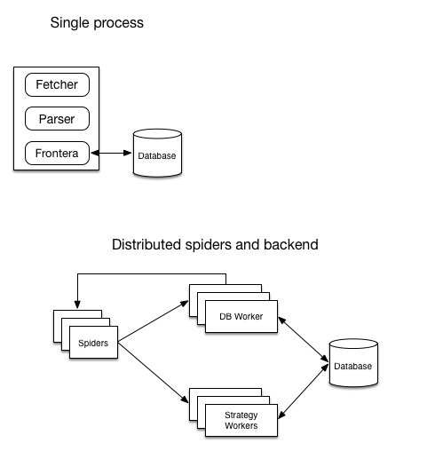

=========
Run modes
=========

A diagram showing architecture of running modes:

====================  =========================================================================  ======================================================  =====================
Mode                  Parent class                                                               Components needed                                       Available backends
====================  =========================================================================  ======================================================  =====================
Single process        :class:`Backend <frontera.core.components.Backend>`                        single process running the crawler                      Memory, SQLAlchemy
Distributed spiders   :class:`Backend <frontera.core.components.Backend>`                        spiders and single :term:`db worker`                    Memory, SQLAlchemy
Distributed backends  :class:`DistributedBackend <frontera.core.components.DistributedBackend>`  spiders, :term:`strategy worker` (s) and db worker(s).  SQLAlchemy, HBase
====================  =========================================================================  ======================================================  =====================

Single process
==============

Frontera is instantiated in the same process as fetcher (for example in Scrapy). To achieve that use :setting:`BACKEND`
setting set to storage backend subclass of :class:`Backend <frontera.core.components.Backend>`. This run mode is
suitable for small number of documents and time non-critical applications.

Distributed spiders
===================

Spiders are distributed and backend isn't. Backend is running in :term:`db worker` and it's communicating with
spiders using :term:`message bus`.

1. Use :setting:`BACKEND` in spider processes set to
   :class:`MessageBusBackend <frontera.contrib.backends.remote.messgebus.MessageBusBackend>`
2. In DB worker :setting:`BACKEND` should point to :class:`Backend <frontera.core.components.Backend>` subclasse.
3. Every spider process should have it's own :setting:`SPIDER_PARTITION_ID`, starting from 0 to
   :setting:`SPIDER_FEED_PARTITIONS`.
4. Both spiders and workers should have it's :setting:`MESSAGE_BUS` setting set to the message bus class of your choice,
   and other implementation depending settings.

This mode is suitable for applications where it's critical to fetch documents fast, at the same time amount of them
is relatively small.

Distributed spiders and backend
===============================

Spiders and backend are distributed. Backend is divided on two parts: :term:`strategy worker` and :term:`db worker`.
Strategy worker instances are assigned to their own part of :term:`spider log`.

1. Use :setting:`BACKEND` in spider processes set to
   :class:`MessageBusBackend <frontera.contrib.backends.remote.messgebus.MessageBusBackend>`
2. In DB and SW workers :setting:`BACKEND` should point to :class:`DistributedBackend <frontera.core.components.DistributedBackend>` subclasses.
   And selected backend have to be configured.
3. Every spider process should have it's own :setting:`SPIDER_PARTITION_ID`, starting from 0 to
   :setting:`SPIDER_FEED_PARTITIONS`. Last must be accessible also to all DB worker instances.
4. Every SW worker process should have it's own :setting:`SCORING_PARTITION_ID`, starting from 0 to
   :setting:`SPIDER_LOG_PARTITIONS`. Last must be accessible to all SW worker instances.
5. Both spiders and workers should have it's :setting:`MESSAGE_BUS` setting set to the message bus class of your choice
   and selected message bus have to be configured.

Only Kafka message bus can be used in this mode out of the box and SQLAlchemy and HBase distributed backends.

This mode is suitable for broad crawling and large amount of pages.
