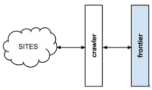

.. _crawl-frontier:

=========================
What is a Crawl Frontier?
=========================

Frontera is a crawl frontier framework, the part of a crawling system that decides the logic and policies to follow
when a crawler is visiting websites (what pages should be crawled next, priorities and ordering, how often pages are
revisited, etc).

A usual crawl frontier scheme is:

The frontier is initialized with a list of start URLs, that we call the seeds. Once the frontier is initialized
the crawler asks it what pages should be visited next. As the crawler starts to visit the pages and obtains
results, it will inform the frontier of each page response and also of the extracted hyperlinks contained within the
page. These links are added by the frontier as new requests to visit according to the frontier policies.

This process (ask for new requests/notify results) is repeated until the end condition for the crawl is reached. Some
crawlers may never stop, that's what we call continuous crawls.

Frontier policies can be based on almost any logic. Common use cases are usually based on scores/priorities,
computed from one or many page attributes (freshness, update times, content relevance for certain terms, etc).
They can also be based in really simple logic as `FIFO`_/`LIFO`_ or `DFS`_/`BFS`_ page visit ordering.

Depending on frontier logic, a persistent storage system may be needed to store, update or query information
about the pages. Other systems can be 100% volatile and not share any information at all between different crawls.

Please refer for further crawl frontier theory at `URL frontier`_ article of Introduction to Information Retrieval book
by Christopher D. Manning, Prabhakar Raghavan & Hinrich Schütze.

.. _FIFO: http://en.wikipedia.org/wiki/FIFO
.. _LIFO: http://en.wikipedia.org/wiki/LIFO_(computing)
.. _DFS: http://en.wikipedia.org/wiki/Depth-first_search
.. _BFS: http://en.wikipedia.org/wiki/Breadth-first_search
.. _URL frontier: http://nlp.stanford.edu/IR-book/html/htmledition/the-url-frontier-1.html